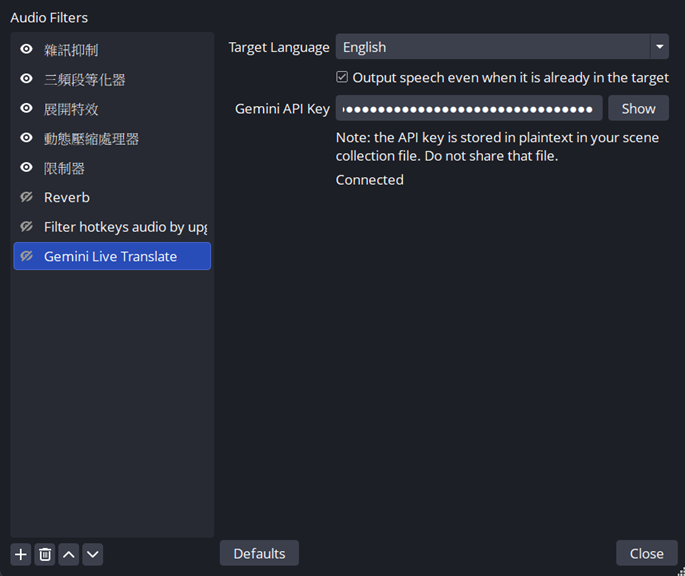
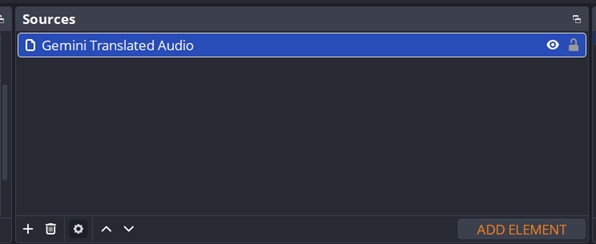

# Gemini Live Translate for OBS

A native OBS Studio plugin (**Windows · macOS · Linux**) that does real-time
**speech-to-speech** translation using the Google **Gemini Live API**
(`gemini-3.5-live-translate-preview`). It captures a microphone's audio, streams
it to Gemini, and plays the translated speech back as a separate OBS audio
source you can route to its own track — so a stream/recording can carry both the
original voice and a live translation.

> This plugin was built with significant assistance from AI (Claude). It is an
> independent project and is not affiliated with or endorsed by the OBS Project
> or Google. Bug reports and contributions are welcome.

## How it works

The plugin registers two OBS sources:

1. **Gemini Live Translate** *(audio filter)* — add it to your microphone source.
   It resamples the mic to 16 kHz mono 16-bit PCM, chunks it (100 ms /
   3200-byte chunks), and streams it **continuously** to Gemini over a TLS
   WebSocket — including the silence during pauses, which the model relies on to
   detect when an utterance ends and emit its translation promptly. Configure
   your **API key**, **target language**, and the **echo** option in its
   properties.

2. **Gemini Translated Audio** *(audio source)* — add it to your scene on its own
   audio track. It receives the 24 kHz translated PCM from Gemini and pushes it
   into the OBS mixer as it arrives.

```
mic ─▶ [Gemini Live Translate filter]
          resample 16 kHz mono → chunk → WebSocket ─▶ Gemini Live API
                                                          │ 24 kHz PCM
                                                          ▼
       [Gemini Translated Audio source] ◀── ring buffer ◀┘
          event-driven push loop → obs_source_output_audio → OBS mixer
```

A single shared `TranslationSession` owns the WebSocket connection (with
reconnect/backoff) and the input/output audio buffers. The output path pushes
every received PCM chunk to OBS with contiguous, duration-spaced timestamps,
paced so the scheduling lead stays bounded (~600 ms, enough to ride out the
model's phrase-boundary delivery jitter) — the OBS mixer is the clock.

## Getting a Gemini API key

The plugin needs a Google **Gemini API key**:

1. Sign in to **Google AI Studio** at <https://aistudio.google.com/apikey> with
   a Google account.
2. New users: AI Studio creates a default Google Cloud project and key
   automatically once you accept the Terms of Service. Otherwise click
   **Create API key**.
3. Copy the key and paste it into the **Gemini API Key** field of the *Gemini
   Live Translate* filter.

Notes:

- The key is stored **in plaintext** in your scene-collection file — don't share
  that file.
- `gemini-3.5-live-translate-preview` usage is billed per Google's pricing;
  check current quotas and pricing in AI Studio
  ([pricing](https://ai.google.dev/gemini-api/docs/pricing)).

## Status

Released for Windows x64 — grab a prebuilt installer or zip from the
[Releases](https://github.com/weisunglee/obs-live-translate/releases) page.
Current behavior:

- ✅ Mic → Gemini streaming (continuous, including pause silence), translated
  audio played back via the OBS mixer.
- ✅ Reconnect with exponential backoff; live API-key / target-language changes.
- ✅ Event-driven push output with a bounded scheduling lead (~600 ms) to ride
  out the model's phrase-boundary delivery jitter.
- ✅ Optional **echo** toggle (default on): output speech even when it is already
  in the target language. With it off, input already in the target language
  stays silent.
- ✅ Sentence endings play in full — streaming the mic continuously (silence
  included) lets the model detect when an utterance ends and emit it promptly,
  instead of holding it until the next one starts.
- ⚠️ The translated audio lags your speech by a few seconds — the model's
  translation latency plus a fixed ~600 ms smoothing buffer (which doesn't
  accumulate; measured backlog stays <50 ms). Tip: when **recording**, pause a
  beat after your last sentence before hitting stop so the trailing translation
  is captured. **Live streams** aren't affected.

## Install (prebuilt)

Download the package for your platform from the
[Releases](https://github.com/weisunglee/obs-live-translate/releases) page, **with
OBS closed**:

- **Windows** — run `…-windows-x64-installer.exe` (it detects your OBS install
  automatically), or extract `…-windows-x64.zip` into your OBS Studio directory
  (e.g. `C:\Program Files\obs-studio\`). Unsigned, so SmartScreen may warn.
- **macOS** — unzip `…-macos-universal.zip` and copy `obs-live-translate.plugin`
  into `~/Library/Application Support/obs-studio/plugins/`. Unsigned / not
  notarized; if Gatekeeper blocks it, run
  `xattr -dr com.apple.quarantine ~/Library/Application\ Support/obs-studio/plugins/obs-live-translate.plugin`.
- **Linux** — extract `…-linux-x86_64.tar.gz` into `~/.config/obs-studio/plugins/`
  (the `.so` should end up at
  `~/.config/obs-studio/plugins/obs-live-translate/bin/64bit/obs-live-translate.so`).

> The macOS and Linux packages are produced by CI but **not yet verified on those
> platforms** — feedback is welcome. Windows is the tested platform.

## Usage

1. Add the **Gemini Live Translate** filter to your microphone source
   (right-click the mic → *Filters* → **+** → *Gemini Live Translate*). Paste your
   API key, pick a target language, and leave **echo** on. Once it connects the
   status reads *Connected*.

   

2. Add a **Gemini Translated Audio** source to your scene (Sources → **+** →
   *Gemini Translated Audio*). This plays the translated voice; route it to its
   own track in *Advanced Audio Properties* to keep it separate from your mic.

   

## Build (Windows x64)

Requires Visual Studio 2022, CMake ≥ 3.28, and libobs (OBS 31.x). Dependencies
(nlohmann/json, IXWebSocket + mbedTLS) are fetched automatically by CMake;
libobs/obs-deps are provisioned via `buildspec.json`.

```powershell
# Configure (downloads OBS deps on first run)
cmake --preset windows-x64

# Build the plugin DLL + tests
cmake --build --preset windows-x64

# Build only the libobs-free unit tests
cmake --build --preset windows-x64 --target unit-tests
```

The build produces `build_x64\RelWithDebInfo\obs-live-translate.dll`. Copy it to
`…\obs-studio\obs-plugins\64bit\` (OBS must be closed) to install.

## Test

```powershell
# Run the full unit-test suite
ctest --test-dir build_x64 --output-on-failure

# Run a single test case by name
ctest --test-dir build_x64 -R "<test case name>" --output-on-failure
```

The `unit-tests` target covers the pure logic (base64, ring buffer, backoff,
audio conversion, audio pacing/timestamper, Gemini protocol parsing) and does
**not** require libobs.

## Project layout

```
src/
  plugin-main.cpp        module entry; registers the filter + source
  filter.cpp             mic filter: resample → chunk → stream (continuous)
  source.cpp             translated-audio source: event-driven push loop
  translation-session.*  shared WebSocket session + audio buffers + reconnect
  live-protocol.*        build/parse Gemini Live API messages
  audio-pacing.*         OutputTimestamper (contiguous, lead-bounded timestamps)
  audio-convert.*        PCM downmix / conversion / chunking
  ring-buffer.*          bounded byte ring buffer
  backoff.*              exponential reconnect backoff
  base64.*, languages.hpp
tests/                   Catch2 unit tests (one per pure module)
installer/               Inno Setup script for the Windows installer
cmake/, CMakePresets.json, buildspec.json
```

## Tech stack

C++17 · CMake (obs-plugintemplate) · libobs (OBS 31.x) · IXWebSocket (TLS via
mbedTLS) · nlohmann/json · Catch2.

## Key API facts

- Model: `models/gemini-3.5-live-translate-preview` over a TLS WebSocket.
- **Input** to Gemini: 16 kHz, 16-bit PCM, mono, little-endian, 100 ms chunks.
- **Output** from Gemini: 24 kHz, 16-bit PCM, mono.
- `translationConfig` takes `targetLanguageCode` (BCP-47) and
  `echoTargetLanguage`; there is **no source-language parameter** — the model
  auto-detects the spoken language.

## Supported languages

The **target language** dropdown offers the languages
`gemini-3.5-live-translate-preview` supports (from the
[official Live Translate docs](https://ai.google.dev/gemini-api/docs/live-api/live-translate)),
each labelled with its native name plus the English name (e.g. `日本語
(Japanese)`) so both native speakers and others can recognize it. Common
languages — English, Chinese, Japanese, Korean, Spanish, French, German,
Portuguese (BR), Italian, Russian, Indonesian, Thai, Vietnamese — are pinned to
the top; the rest follow in English-name alphabetical order. The exact list and
BCP-47 codes live in [`src/languages.hpp`](src/languages.hpp).

Chinese uses the script-less code **`zh`**, not `zh-Hant` / `zh-Hans`. Output is
speech, which has no script, so the script-specific codes sound identical — and
they break same-language echo (the model doesn't treat spoken Mandarin as an
exact match for a script-tagged target), whereas `zh` translates and echoes
correctly.

There is **no source-language selection** — Gemini auto-detects the spoken
language, so you only pick what to translate *into*.

## Non-goals (v1)

Captions/subtitles, multiple simultaneous sessions, encrypted key storage, and
explicit source-language selection are out of scope.

## License

Licensed under the GNU General Public License v2.0 — see [LICENSE](LICENSE).
This matches OBS Studio's licensing, since the plugin links against libobs.
